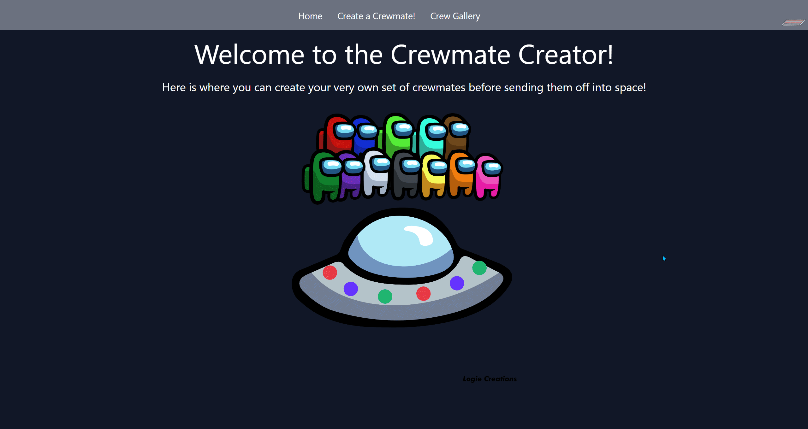

# Web Development Project 7 - *Crewmates*

Submitted by: **Shi Wei Zheng**

This web app: **This app allows user to add, update, delete crewmates. A list of all the crewmates will be display in the gallery.**

Time spent: **7** hours spent in total

## Required Features

The following **required** functionality is completed:

- [x] **A create form allows users to add new cremates**
- [x] **Users can name the crewmate and set the crewmate's attributes by clicking on one of several values**
- [x] **The site displays a summary page of all the user's added crewmates**
- [x] **A previously created crewmate can be updated and deleted from the crewmate list**
- [x] **Each crewmate has a direct, unique link to an info page about them**

The following **optional** features are implemented:

- [ ] A crewmate can be given a category upon creation which restricts their attributes
- [ ] The site displays summary statistics about a user's crew on their crew page 
- [ ] The site displays a custom "success" metric about a user's crew which changes the look of the crewmate list

The following **additional** features are implemented:

* [ ] List anything else that you added to improve the site's functionality!

## Video Walkthrough

Here's a walkthrough of implemented user stories:

<!-- Replace this with whatever GIF tool you used! -->
GIF created with ShareX  
<!-- Recommended tools:
[Kap](https://getkap.co/) for macOS
[ScreenToGif](https://www.screentogif.com/) for Windows
[peek](https://github.com/phw/peek) for Linux. -->

## Notes

Describe any challenges encountered while building the app. 
- It is my first time using Tailwind CSS so I was having a bit of trouble using it on my project. I was able to get used to the utility classes and understand how Tailwind CSS works.
- When I was trying to filter the result from the database using the id. I figured out that when getting the param from the url, it returns as a string instead of integer. Instead of using ===, I realized I have to use == to compare the id from the database and the id from the param.

## License

    Copyright [2023] [Shi Wei Zheng]

    Licensed under the Apache License, Version 2.0 (the "License");
    you may not use this file except in compliance with the License.
    You may obtain a copy of the License at

        http://www.apache.org/licenses/LICENSE-2.0

    Unless required by applicable law or agreed to in writing, software
    distributed under the License is distributed on an "AS IS" BASIS,
    WITHOUT WARRANTIES OR CONDITIONS OF ANY KIND, either express or implied.
    See the License for the specific language governing permissions and
    limitations under the License.